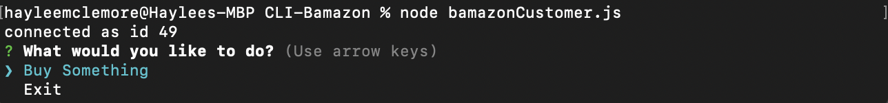
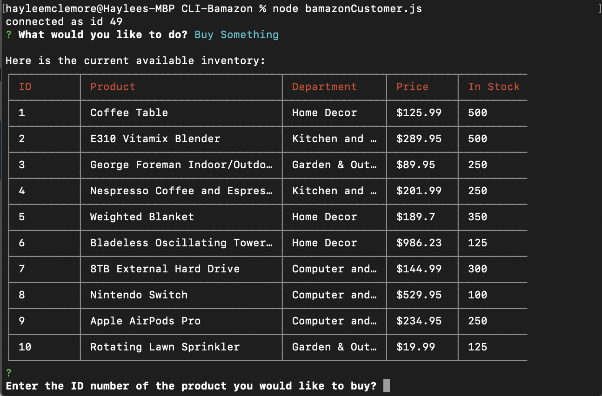
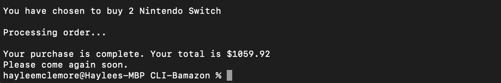

# CLI-Bamazon

Bamazon is a command line(CLI) application, an Amazon-like storefront that takes in orders from customers and depletes stock from the store's inventory. This application takes in parameters and returns data using the npm [inquirer](https://www.npmjs.com/package/inquirer) package and the MySQL database backend in conjunction with the npm [mysql](https://www.npmjs.com/package/mysql) package.
 
The purpose was to use "backend" technologies only. Node.js and MySQL skills were used along with NPM (Node Package Manager) in order to accomplish the tasks.

## MySQL Database
   In order to run this application you will need to have MySQL database set up on your machine. If you don't already have it installed, you can install the correct version for your machine [here](https://www.npmjs.com/package/mysql). Once MySQL has been installed, you will be able to create the Bamazon database and products table using the SQL code found in schema.sql. Run this code inside MySQL to populate the database before running the customer interface.

## Customer Interface
To run the customer interface follow the steps below:

* **`git clone git@github.com:hayleemclemore/CLI-Bamazon.git`**
* **`cd CLI-Bamazon`**
* **`npm install`**
* **`node bamazonCustomer.js`**

* User is given the option to 'Buy Something' or 'Exit' the customer interface. If the user selects, 'Buy Something', the inventory is displayed.

* The user is prompted to provide the ID number of the item they would like to purchase, followed by the quantity, and a confirmation check to make sure the product ID and quantity are correct. 

* Once the user confirms the information is correcf, they are present with their pruchase information and the total cost of the purchase. The inventory is updated to reflect the new stock-quantity after the items have been purchased. 

## Links
[Repository](https://github.com/hayleemclemore/CLI-Bamazon)

## Technologies used in the app:
    * Javascript
    * Node.js
    * MySQL
